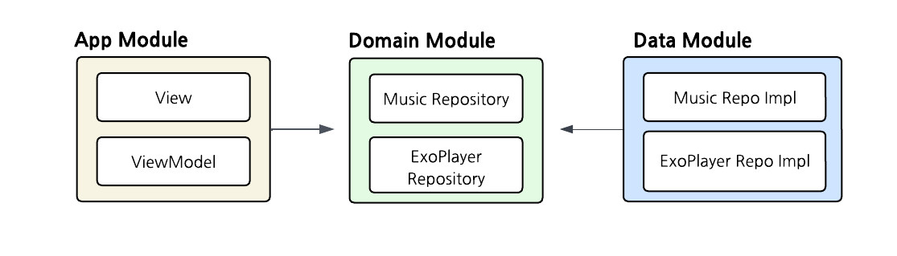
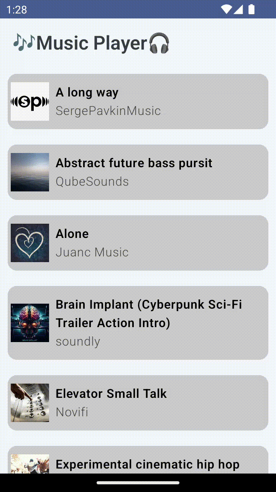

# Music Player Android App

## 1. Overview
Android Music Player using ExoPlayer
<br/><br/><br/>

## 2. Tech Stack
 *Android, Jetpack Compose, ExoPlayer, Multi module, Hilt, Coroutines, Coil, MediaStore*
<br/><br/><br/>

## 3. Multi Module Architecture

 <br/>
 
| Module | Description |
|-------|-------|
| App | Activity, Screens: Entry point of the application |
| Domain | Entity, Repository Interface: Encapsulates business login |
| Data | Repository Implementation: Access mp3 file via MediaStore  |

<br/><br/>

## 4. Feature & Screenshots
- Display music list

<br/><br/>

- Play music and navigate to detail screen
  - Play & Pause music  
  - Set position by slider

<br/><br/>

- Play next & prev music

<br/><br/><br/>

## 5. Installation
1. Clone the repository:
   ```bash
   git clone https://github.com/Ddudduu/MusicPlayer.git
   ```
2. Open in Android Studio
3. Build and run the app on an emulator or physical device
- Minimum SDK: 24
- Compile SDK: 35
- Target SDK: 34
